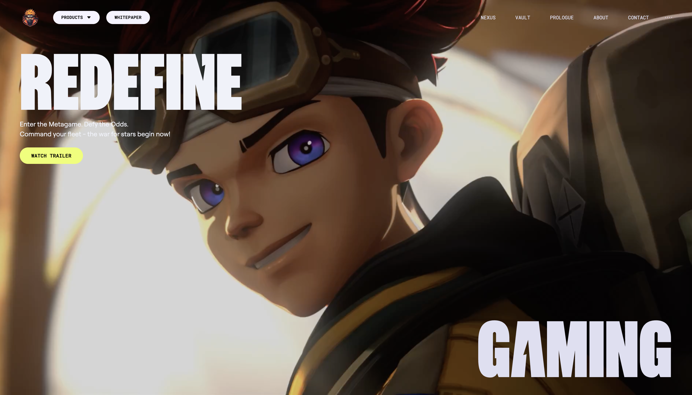

# Gaming Website Clone with React & Tailwind CSS

This project is a **clone of [Zentry](https://www.zentry.com)**, a modern gaming website - built with **React** and styled using **Tailwind CSS**. It is developed alongside Javascript Mastery's [video tutorial](https://www.youtube.com/watch?v=zA9r5zTllx4) which provided guidance on the development process, as well as assets for the project.

The objective of this project was to explore **Tailwind’s utility-first design** and experiment with **animations** in a React app. The focus was on creating an interactive UI that closely mirrors the original site’s look, while also incorporating custom animation tweaks and personal design choices.

> **Note:** This project is a work in progress and is **not fully responsive** at the moment. For the best experience, please view it on a desktop-sized screen. Check the [Planned Enhancements](#planned-enhancements) for upcoming improvements to responsiveness.

<br />

## 🚀 Features

- **Interactive UI Components:** Built dynamic, reusable components that responds to user interactions, enhancing engagement and usability.
- **Scroll Animations:** Integrated scroll-triggered animations to improve visual flow and user experience - with plans for further enhancements.
- **Bento Grids Layout:** Implemented a modern, responsive grid system inspired by current design trends to achieve a visually engaging layout.

<br />

## 💻 Tech Stack

- **React**: A Javascript library for building dynamic, component-based interfaces.
- **Vite:** A modern build tool that streamlines development and delivers optimized bundling.
- **Tailwind CSS:** A utility-first CSS framework that enables rapid styling with flexible customization.
- **GSAP:** A Javascript animation library for creating smooth, high-performance animations.

<br />

## 👾 Demo

Check out the live demo here: [Zentry Clone](https://mengxian98.github.io/zentry-clone/)

Ready for a sneak peek of the fun stuff?

### Landing Hero

Hover effects, animated scrolls, and a hero that actually feels heroic.

<a href="https://drive.google.com/file/d/1vippGhOkyyg7IxEy90clXEmghM1oLY7A/view?usp=sharing">
  
</a>

### Bento Grid Layout

Like a lunchbox for your content — neat and snappy! (oh wait… it’s responsive? 👀)


That’s just a teaser — dive in and discover all the motion, magic, and hidden gems waiting for you!

<br />

## 📦 Getting Started

### Prerequisites

- [Node.js](https://nodejs.org/)
- [npm](https://www.npmjs.com/)

### Installation

Clone the repository:

```bash
git clone https://github.com/mengxian98/zentry-clone.git
cd zentry-clone
```

Install dependencies:

```bash
npm install
```

### Running the Project

Start the development server:

```bash
npm run dev
```

View the project at [http://localhost:5173](http://localhost:5173).

<br />

## 💡 Planned Enhancements

### New Features

- Add a loading spinner to enhance the initial page load experience
- Introduce a "Latest Updates" section to serve as a lead-in to the "Contact" area

### Responsiveness

- Implement a mobile-friendly navigation menu
- Refactor the hero section layout to better adapt across smaller screen sizes
- Review and polish the current responsive setup using Tailwind’s design tokens

### Animations

- Add hover effects to the navigation bar and reusable button component
- Refine scroll-based animations to behave consistently in both directions
